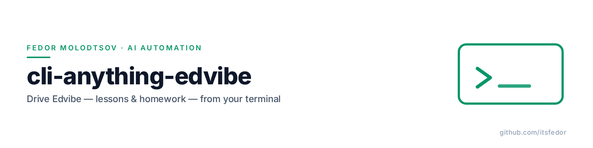
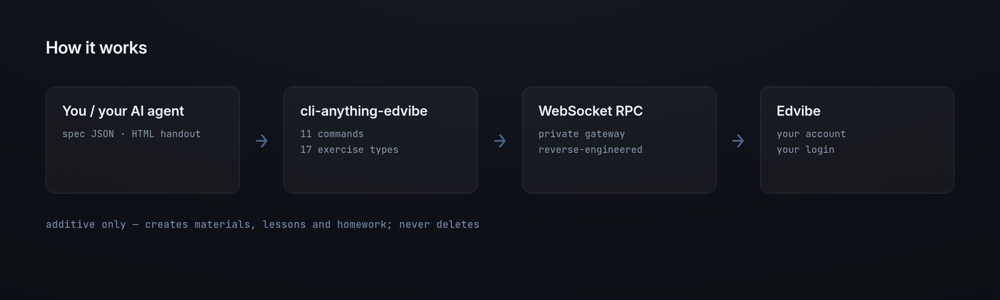

<picture>
  <source media="(prefers-color-scheme: dark)" srcset="assets/banner-dark.png">
  
</picture>

<p align="center"><sub><b>Fedor Molodtsov</b> — AI automation engineer · <a href="https://github.com/itsfedor">github.com/itsfedor</a></sub></p>

# ⌨️ cli-anything-edvibe: drive Edvibe from your terminal

**A reverse-engineered CLI for [edvibe.com](https://edvibe.com) — the ESL teaching platform with no public API.**

[](https://www.python.org/)
[](LICENSE)
[-2ea043.svg)](#tests)
[](skills/cli-anything-edvibe/SKILL.md)

Edvibe (formerly ProgressMe) keeps everything — materials, lessons, students,
homework — behind a **private WebSocket RPC gateway**; there is no official API.
This project reverse-engineered that protocol and wraps it in a small,
scriptable CLI, so you (or your AI agent) can build and inspect real course
content from the command line instead of clicking through the UI.

In daily use for a working ESL practice: multi-stage lessons, vocabulary
blocks, answer keys and per-student homework are all created through it.

## Installation

Requires **Python 3.9+**. No Node, no server, no extras.

```bash
git clone https://github.com/itsfedor/cli-anything-edvibe
cd cli-anything-edvibe
pip install -e .
```

Or as a one-liner with [pipx](https://pipx.pypa.io):

```bash
pipx install git+https://github.com/itsfedor/cli-anything-edvibe
```

Check the setup:

```bash
cli-anything-edvibe doctor
```

Then log in once — the session token is cached at `~/.edvibe/session.json`
(mode 600); your password is never stored and never leaves your machine:

```bash
cli-anything-edvibe login        # asks for email + hidden password
```

Non-interactive alternative for scripts:

```bash
export EDVIBE_EMAIL="you@example.com"
export EDVIBE_PASSWORD="..."
```

> The CLI only works with *your* account: every request runs from your machine,
> under your login. Nothing is shared between users.

*Already using the [ESL Automation Suite](https://github.com/itsfedor/esl-automation-suite)?*
Its setup script installs this same CLI from a bundled wheel.

## Use cases

**1 · Turn an HTML handout into platform material.** Any structured HTML
lesson guide becomes a material with one lesson and one content block per
`<h2>` section — headings, lists, tables all preserved:

```bash
cli-anything-edvibe --json import --html "handout.html"
```

**2 · Build a complete lesson from a JSON spec.** Sections and exercises of
17 types (vocabulary match, gap-fill, video, true/false, quiz, voice task,
word order, ...), with dry-run validation first:

```bash
cli-anything-edvibe lesson build --file lesson-spec.json --material 12345 --dry-run
cli-anything-edvibe lesson build --file lesson-spec.json --material 12345
```

**3 · Give homework.** Append exercises to one student's homework sheet —
numbering continues after the current last task, and nothing existing is
touched:

```bash
cli-anything-edvibe homework add --file homework-spec.json --dry-run   # plan only
cli-anything-edvibe homework add --file homework-spec.json             # attach
```

**4 · Inspect the class (read-only).** Find a student, open their classroom,
read the current homework sheet:

```bash
cli-anything-edvibe students list --search "Ann"
cli-anything-edvibe classroom show --student "Ann"
cli-anything-edvibe homework show --lesson 12345678 --pupil 23456789 --class-id 34567890
```

**5 · Let your AI agent drive it.** The repo bundles an
[agent skill](skills/cli-anything-edvibe/SKILL.md) (agentskills.io format) that
teaches Hermes Agent, Claude Code or Codex the whole workflow — lessons and
homework get built from chat while this CLI does the talking.

## How it works

<p align="center">
  
</p>

- **Transport** — WebSocket `wss://proxy-a.edvibe.com/websocket?token=...`;
  requests are `{Controller, Method, ProjectName, RequestId, Value}` frames,
  and the `Auth-Token` is a client-minted UUIDv4 (no server handshake).
- **Model** — a material is a Book → Course → Lesson(unit) → Section →
  Exercises; content blocks are "Note" exercises holding arbitrary HTML.
- **Login** — two RPCs on `AccountWsController`: `GetAccountRoles` → `Login`.

The full protocol write-up, including the GUI-action → command mapping, lives
in [`EDVIBE.md`](EDVIBE.md).

## Command reference

| Command | What it does |
|---|---|
| `whoami` / `logout` | show / forget the cached session |
| `login [--check]` | log in once; `--check` verifies the cached session |
| `doctor` | check python, dependencies, session, live connectivity |
| `materials list` | folders & books |
| `materials create "Name"` | create a material |
| `lesson add --material ID --name "Unit 1"` | add a lesson (auto-creates its first section) |
| `lesson show --lesson ID` | sections + exercises |
| `lesson build --file spec.json --material ID` | a whole lesson from a JSON spec |
| `content add-note --lesson ID --section ID --file note.html` | add an HTML content block |
| `content show --lesson ID --section ID` | list exercises in a section |
| `import --html file.html` | HTML handout → new material + lesson + notes |
| `students list [--search X]` / `students show PUPIL_ID` | school students |
| `classroom show --student X` | current lesson + homework overview |
| `homework show --lesson ID --pupil ID --class-id ID` | read a homework sheet |
| `homework add --file spec.json` | append exercises to a sheet |
| `homework attach --lesson ID --pupil ID --class-id ID [--section ID]` | attach existing lesson exercises |
| `homework give --lesson ID --class-id ID [--pupil ID]` | give homework end-to-end |

Add `--json` anywhere for machine-readable output. Bare `cli-anything-edvibe`
opens a REPL.

## Specs

Both `lesson build` and `homework add` take plain JSON.

Lesson spec:

```json
{
  "lesson_name": "Present Perfect",
  "sections": [
    {"name": "Warm-Up", "exercises": [
      {"type": "note",  "html": "<p>...</p>"},
      {"type": "match", "instruction": "Match the pairs", "pairs": [["a", "b"]]}
    ]}
  ]
}
```

Homework spec (appends to one student's sheet):

```json
{
  "lesson_id": 12345678,
  "pupil_id": 23456789,
  "class_id": 34567890,
  "homework_lesson_id": 45678901,
  "exercises": [{"type": "truefalse", "statements": [["...", true]]}]
}
```

Exercise types: `note`, `text`, `topic`, `video`, `wordlist`, `writing`,
`match`, `filltyped`, `fillbox`, `chooseoption`, `wordorder`, `sortcolumns`,
`ordersentences`, `truefalse`, `test`, `voice`, `button` (aliases like `tf`,
`quiz`, `gaps` also work). Full details in
[`lesson_spec.py`](cli_anything/edvibe/core/lesson_spec.py) and
[`homework_spec.py`](cli_anything/edvibe/core/homework_spec.py).

## Safety

- **Additive only.** The harness has **no delete command** by design — it can
  create and read, never remove. Tests only ever create `CLI-HARNESS-*`
  objects.
- **Human-like pacing.** Calls are jittered 0.8–2.0 s apart and capped at
  150/hour per process, so account traffic looks like one teacher working
  manually (`EDVIBE_PACE_OFF=1` disables it for local tests).
- **Credentials stay local.** Only the session token is cached
  (`~/.edvibe/session.json`, mode 600); passwords are never stored.

## Tests

```bash
python -m pytest cli_anything/edvibe/tests/test_core.py \
                 cli_anything/edvibe/tests/test_homework_spec.py -q   # 15 offline tests

EDVIBE_EMAIL=... EDVIBE_PASSWORD=... \
  python -m pytest cli_anything/edvibe/tests/test_full_e2e.py -v      # 5 live tests
```

The live suite runs against your own account and creates only fresh
`CLI-HARNESS-E2E` objects. Test history and the pre-implementation test plan
are in [`tests/TEST.md`](cli_anything/edvibe/tests/TEST.md).

## A note on the platform

This is an unofficial, community-style tool: the protocol was recovered by
studying the web client's traffic. Edvibe can change it at any time (the
project's tests and `doctor` make breakage obvious). If you're the platform
and you'd like something changed here — open an issue.

## License

[MIT](LICENSE)
